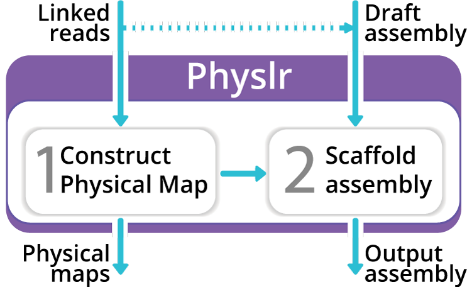

[](https://www.mdpi.com/2673-8856/2/2/9)
[](https://github.com/bcgsc/physlr/releases)
[](https://anaconda.org/bioconda/physlr)
[](https://github.com/bcgsc/physlr/releases/download/v1.0.2/physlr-1.0.2.tar.gz)

<p align="center">
  
</p>

Physlr: Next-generation Physical Maps
================================================================================

Physlr `physical-map` constructs a *de novo* physical map using linked reads from 10X Genomics or MGI stLFR. This physical map can then be used for various genomics analyses, including scaffolding. Physlr `scaffolds` uses the physcial map generated in the first stage to scaffold an existing genome assembly to yield chromosome-level contiguity.

<p align="center">
  
</p>

Contents
================================================================================
* [Installation](#installation)
	* [Install Physlr using Conda](#install-physlr-using-conda)
	* [Compile Physlr from source](#compile-physlr-from-source)
	   * [Compiling](#compiling)
	   * [Dependencies](#dependencies)
	   * [Optional dependencies](#optional-dependencies)
* [Running Physlr](#running-physlr)
   * [Generate a physical map](#generate-a-physical-map)
   * [Scaffold an assembly](#scaffold-an-assembly)
   * [Output files](#output-files)
* [Citation](#citation)
* [Support](#support)
* [Acknowledgements](#acknowledgements)


Installation
================================================================================
You can install Physlr either via Conda or by compiling from source. We recommend installing Physlr via [Conda](https://docs.conda.io/en/latest/) package manager (Linux, MacOS), which will handle compilation and dependencies automatically.

## Install Physlr using Conda
In an active `conda` environment:
```
conda install -c bioconda physlr
physlr help
```
Physlr can generate complmentary reports (included in the pipeline by default), you can install dependencies for these optional features using conda:
```
conda install -c r r-rmarkdown
conda install -c conda-forge r-ggplot2
```

## Compile Physlr from source
### Compiling

Compile Physlr using the following commands:
```
pip3 install --user git+https://github.com/bcgsc/physlr
git clone https://github.com/bcgsc/physlr
cd physlr/src && make install
```

or, to install Physlr in a specified directory (like `/opt/physlr`):

```
pip3 install --user git+https://github.com/bcgsc/physlr
git clone https://github.com/bcgsc/physlr
cd physlr/src && make install PREFIX=/opt/physlr
```
after compiling, Physlr commands will be avilable through:
```
bin/physlr-make
bin/physlr-make help
```
### Dependencies

* [ntCard](https://github.com/bcgsc/ntCard)
* [ntHits](https://github.com/bcgsc/ntHits)
* GCC 5 or newer with [OpenMP](https://www.openmp.org) and [boost](https://www.boost.org)
* Python 3.5 or newer and the following packages
    * [community](https://python-louvain.readthedocs.io/en/latest/api.html)
    * [networkx](https://networkx.github.io/)
    * [numpy](https://numpy.org/)
    * [scipy](https://www.scipy.org/)
    * [sklearn](https://scikit-learn.org/stable/)
    * [tqdm](https://tqdm.github.io/)
	
Additionally, we recommend using `pypy3` over regular python3 for speed. 
pypy v3 or `pypy3` is the default python executable for Physlr. To switch to other executables set the `python_executable` argument:
```
physlr [OPTION]... python_executable=python3
```
If you install our tool via `conda`, pypy3 is included as a dependency. Otherwise, you can install pypy3 using conda:
```
conda install -c conda-forge pypy3.7 # for python3.7
```

### Optional dependencies

- [pigz](https://zlib.net/pigz/) for parallel gzip
- [zsh](https://sourceforge.net/projects/zsh/) for reporting time and memory usage

Running Physlr
================================================================================

## Generate a physical map
To construct a physical map _de novo_, you need linked reads (from 10X Genomics or MGI stLFR). 

In this example, the linked reads dataset is called `linkedreads.fq.gz`. The linked reads are from stLFR so we specify `protocol=stlfr` to use the default value for stLFR reads.

```
cd experiment # Change to working directory 
physlr physical-map lr=linkedreads protocol=stlfr                # Constructs the physical map
```
You also have the option to provide a reference genome (with `ref`) for Physlr to evaluate the physical map. Assuming the reference is called `reference.fa`, you can run the following command for the previous example:
```
cd experiment
physlr physical-map lr=linkedreads ref=reference protocol=stlfr  # Constructs the physical map and reference-based evaluations for it
```

If you provide a reference genome, Physlr first constructs a physical map and then maps it to the input reference. In this case, Physlr automatically outputs a `*.map-quality.tsv` file reporting assembly-like quality metrics for the physical map. In addition, Physlr visualizes the correctness and contiguity of the physical map.

You can also independently run the physical map construction and evaluation steps:
```
cd experiment
physlr physical-map lr=linkedreads protocol=stlfr
physlr map-quality lr=linkedreads ref=reference
```

## Scaffold an assembly
To scaffold a draft assembly, you need linked reads from 10X Genomics or stLFR, and an existing assembly. 
In this example, the linked reads and draft assembly are called `linkedreads.fq.gz` and `draft.fa`, respectively. The linked reads are from 10X Genomics so we specify `protocol=10x` to use the default value for 10X Genomics reads.

```
cd experiment
bin/physlr-make scaffolds lr=linkedreads draft=draft protocol=10x
```
You can also include a reference genome ('reference.fa' in this example) for Physlr to calculate Quast summary metrics for the Physlr scaffolded assembly:
```
cd experiment
bin/physlr-make scaffolds lr=linkedreads ref=reference draft=draft protocol=10x
```

See the help page for further information.
`bin/physlr-make help`

## Output files

* `lr.physlr.physical-map.path`: Paths of barcodes (backbones).
* `lr.physlr.physical-map.ref.n10.paf.gz.*.pdf`: Various graphs showing the contiguity and correctness of the backbones with respect to the reference.
* `draft.physlr.fa`: Physlr scaffolded assembly using the physical map.
* `draft.physlr.quast.tsv`: Quast metrics comparing the Physlr scaffolded assembly against the reference.

Demo
================================================================================


Citation
================================================================================

If you use Physlr in your research, please cite:

Afshinfard A, Jackman SD, Wong J, Coombe L, Chu J, Nikolic V, Dilek G, Malkoç Y, Warren RL, Birol I. Physlr: Next-Generation Physical Maps. DNA. 2022 Jun 10;2(2):116-30. doi: https://doi.org/10.3390/dna2020009

[](https://doi.org/10.3390/dna2020009)

Support
================================================================================

[Create a new issue on GitHub.](https://github.com/bcgsc/physlr/issues)

[](https://gitHub.com/bcgsc/physlr/issues)

Acknowledgements
================================================================================

This projects uses:
* [btl_bloomfilter](https://github.com/bcgsc/btl_bloomfilter) BTL C/C++ Common bloom filters for bioinformatics projects implemented by Justin Chu
* [nthash](https://github.com/bcgsc/ntHash) rolling hash implementation by Hamid Mohamadi
* [readfq](https://github.com/lh3/readfq) Fast multi-line FASTA/Q reader API implemented by Heng Li
* [robin-map](https://github.com/Tessil/robin-map) C++ implementation of a fast hash map and hash set using robin hood hashing by Thibaut G.
